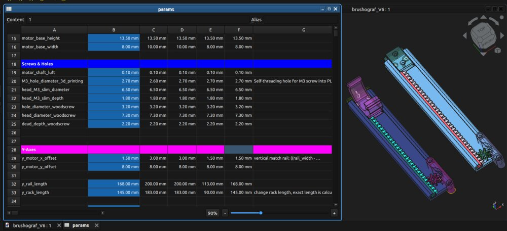
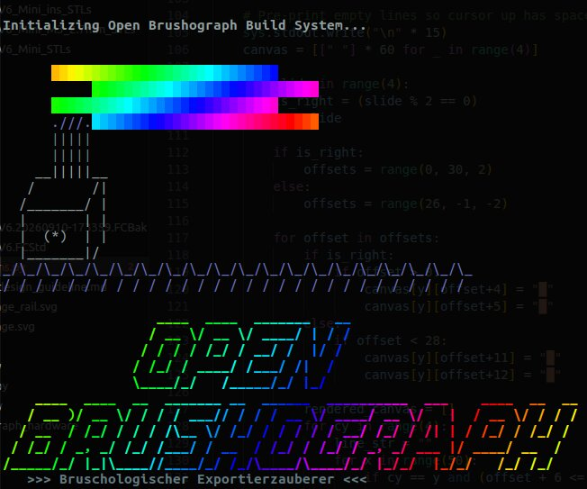
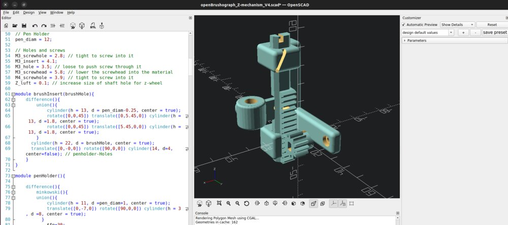
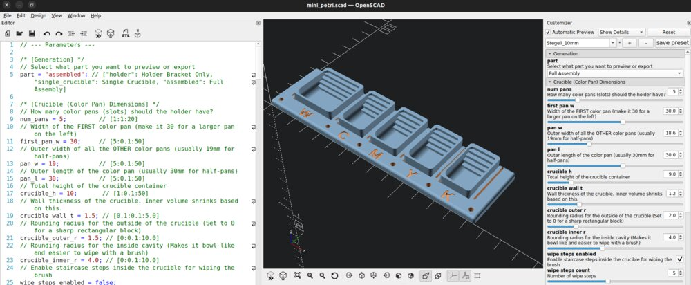
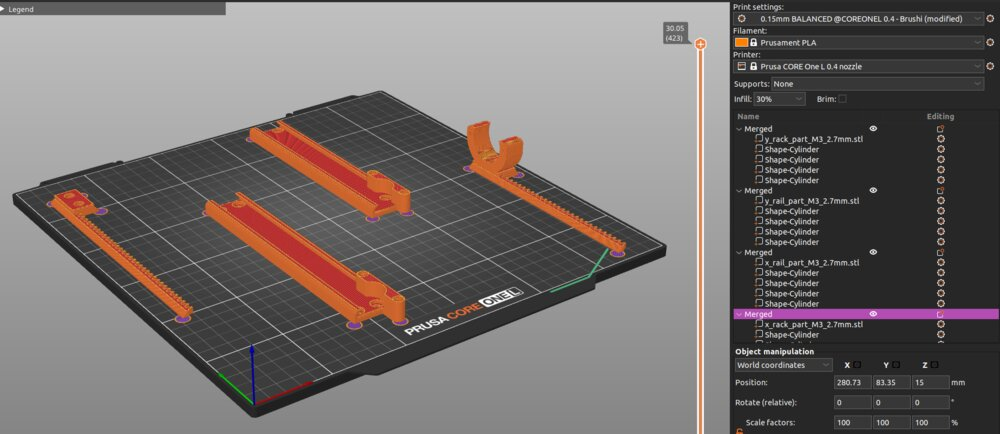
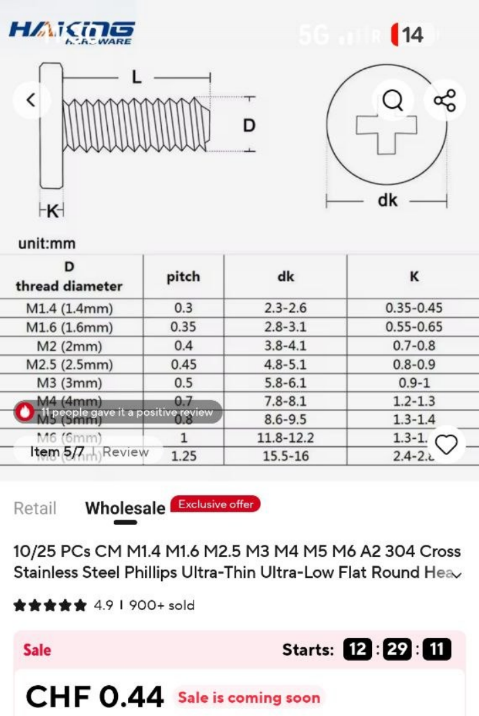
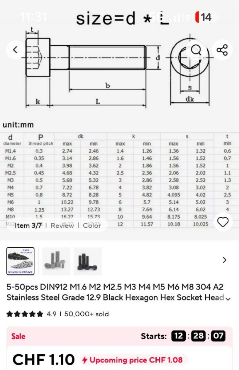
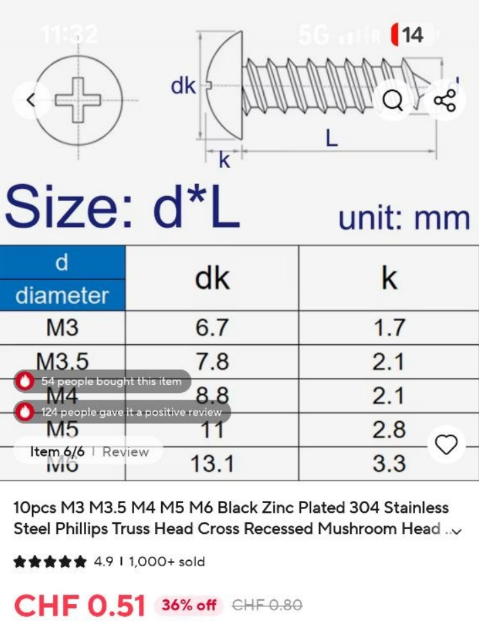

# openBrushograph

A simple, open source and DIY x-y gantry and z-mechanism for making a brush painting robot. Formerly know as Brušograf...

## Quick links
- `X-Y_freeCAD/`: Parametric FreeCAD gantry models and STLs
- `Z-mechanism_openSCAD/`: Parametric OpenSCAD brush lift models and STLs
- LICENSES/: CERN-OHL-S/W/P and CC BY-SA texts

## Overview
openBrushograph is a small CNC-style plotter for brushes and pens. The X–Y gantry is modeled in FreeCAD and the Z mechanism in OpenSCAD.

Full background, tutorials and history live on the SGMK wiki:
https://wiki.sgmk-ssam.ch/wiki/Brushograph


## Downloads (FreeCAD & Pre-exported STLs)

If you just want to get printing immediately, you can grab the FreeCAD source file or the pre-exported STL folders below:
- **FreeCAD Source File:** [brushograf_V6.FCStd](X-Y_freeCAD/brushograf_V6.FCStd)

### Standard Version
- **Mini Variant (M3=2.7mm):** [STLs/brushograf_V6_Mini_M3_2.7mm_STLs](X-Y_freeCAD/STLs/brushograf_V6_Mini_M3_2.7mm_STLs/)
- **Z-Mechanism STLs:** [Z-mechanism_V4_STL](Z-mechanism_openSCAD/Z-mechanism_V4_STL/)

### Special Designs
- **Micro Variant (M3=2.7mm):** [STLs/brushograf_V6_Micro_M3_2.7mm_STLs](X-Y_freeCAD/STLs/brushograf_V6_Micro_M3_2.7mm_STLs/)

*Note: Endless custom versions can be generated using the FreeCAD parameters! For example, you can easily adjust the hole sizes to perfectly fit heated metal threaded inserts, or completely change the general dimensions of the gantry to suit your specific needs (see the **Parametric FreeCAD Design** section below).*

## Parametric FreeCAD Design
The X-Y gantry is designed in FreeCAD as a fully parametric model. 

### Adjusting Parameters


Inside the FreeCAD file (`X-Y_freeCAD/brushograf_V6.FCStd`), you will find a dedicated Spreadsheet object called `params`. This spreadsheet drives the entire 3D geometry!
- You can easily customize the design by modifying values in the parameter rows (e.g., changing the `M3_hole_diameter_3d_printing`).
- The design supports multiple **variants** (e.g., Mini, Micro, Baby). The variant names are defined as column headers in the first row of the spreadsheet (starting from column C).
- By changing the master Switcher value (cell `B1`) to the corresponding column index (1 for C, 2 for D, etc.), FreeCAD will instantly recompute the entire model for that specific variant!

### Automated STL Export Script


To streamline the export process, we include a python build script (`build_versions.py`). 
Running this script via FreeCAD's command line will:
1. Dynamically read your custom variant names from the spreadsheet.
2. Provide an interactive terminal wizard to select which variants you want to build (or build all of them!).
3. Allow you to override specific parameters on the fly (like the M3 hole diameter).
4. Automatically toggle the spreadsheet switcher, force a deep geometry recompute, and export clean STL folders ready for 3D printing directly into the `X-Y_freeCAD/STLs/` directory.

**How to run the script:**
Open a terminal inside the `X-Y_freeCAD` directory and run:
```bash
FreeCADCmd build_versions.py brushograf_V6.FCStd
```
*(Note: Depending on your OS and installation, the FreeCAD command line tool may be named `freecadcmd`, `FreeCADCmd`, or accessed via flatpak: `flatpak run --command=FreeCADCmd org.freecad.FreeCAD`)*

## Parametric OpenSCAD Z-Mechanism


In addition to the FreeCAD X-Y gantry, the Z-mechanism for the brush lift is also fully parametric, designed natively in OpenSCAD!
- You can find the source file and pre-compiled STLs in the `Z-mechanism_openSCAD/` directory.
- Simply open the `.scad` file in OpenSCAD and you can easily tweak variables like mounting hole sizes, brush holder dimensions, and motor fittings before generating your custom STL.

### Extra OpenSCAD Accessories


The OpenSCAD directory also includes parametric models for various extra parts! You can easily generate custom colour holders, petri dishes, and other useful accessories to complete your robotic painting setup.

## Setup options (controllers/firmware)
- FluidNC (ESP32 with WebUI): https://installer.fluidnc.com/
  - About FluidNC: http://wiki.fluidnc.com/en/home
- Arduino (GRBL): https://github.com/gnea/grbl
  - GRBL fork for 28BYJ-48 unipolar steppers: https://github.com/TGit-Tech/GRBL-28byj-48
- Universal Gcode Sender (UGS): https://winder.github.io/ugs_website/

See details and tips on the wiki: https://wiki.sgmk-ssam.ch/wiki/Brushograph#How_to_set_it_up

## Printing and Assembly


### Recommended Materials
For mechanical rigidity and durability, **PLA+** or better **High Temperature PLA+**, other materials such as **PETG** is highly recommended. Standard PLA is also acceptable but may be brittle under high stress or will bend easily in warm environments or in direct sunshine.

The pinions were also printed in other advanced filaments, such as PA612-CF15 for even better mechanical and thermal properties.

### Slicer Settings
For structural parts (like the gantry mounts and Z-mechanism):
- **Perimeters/Walls:** 3 to 4 walls for maximum structural strength.
- **Infill:** 20% to 30% Gyroid.
- **Layer Height:** 0.2mm is an excellent balance between speed and tolerance. For aesthetic reason smaller layer heights can be used.
- **Mouse-ears** are more usefull than larger brims if you have adhesion issues.

### Orientation and Supports
- The pre-exported STLs are generally oriented in their optimal printing position. 
- All parts are designed to print completely **support-free**.

### Hardware and Assembly
- **Threaded Inserts:** Hols can designed specifically for heated metal threaded inserts (e.g. M3). Use a soldering iron to press them in carefully.
- If you find the default hole sizes are too tight or loose for your specific inserts, remember you can always tweak the `M3_hole_diameter_3d_printing` parameter in the FreeCAD spreadsheet and re-export the STLs using the build script!

More context, detailed assembly instructions and legacy designs: https://wiki.sgmk-ssam.ch/wiki/Brushograph#Printing_and_assembling_the_Brushograph

## Bill of Materials (BOM) (in progress...)
A quick overview of the required printed parts and hardware is below:

### X-Y Assembly
| Assembly | Part | Qty | Notes |
|----------|------|-----|-------|
| X | `openBrushograph_x_rail_part.stl` | 1 | Print |
| X | `openBrushograph_x_rack_part.stl` | 1 | Print; higher infill recommended |
| X | `openBrushograph_x_pinion_part.stl` | 1 | Print (its same as y_pinion) |
| X | `openBrushograph_x_endstop_part.stl` | 1 | Print |
| Y | `openBrushograph_y_rail_part.stl` | 1 | Print |
| Y | `openBrushograph_y_rack_part.stl` | 1 | Print; higher infill recommended |
| Y | `openBrushograph_y_pinion_part.stl` | 1 | Print (its same as x_pinion) |

### Z Assembly
| Assembly | Part | Qty | Notes |
|----------|------|-----|-------|
| Z | `openBrushograph_rail_Z-mechanism.stl` | 1 | Print |
| Z | `openBrushograph_rack_Z-mechanism.stl` | 1 | Print |
| Z | `openBrushograph_handWheel.stl` | 1 | Print |
| Z | `openBrushograph_penHolder_Insert_6.5.stl` | 1 | Variants available for different brushes |

### Screws & Hardware
| Type | Image | Part | Qty | Notes |
|------|-------|------|-----|-------|
| flat-head Screw | [](BOM/flathead_screw_M3_6mm.png) | M3x6 | 4 | to fit below the rack into the rails. [Shop Link](https://www.aliexpress.com/item/1005003126053325.html) |
| machine Screw | [](BOM/machine_screw_M3_6mm.png) | M3x6 | 6 | to mount the motors. mbe use longer ones on the z-axes. [Shop Link](https://www.aliexpress.com/item/32810872544.html) |
| Wood-Screw | [](BOM/wood_screw_M3_6mm.png) | M3x6 | 4 | Longer screws if you have a thick wooden base board. [Shop Link](https://www.aliexpress.com/item/1005009268426636.html) |
| Screw | | M4x16 | 1 | for handWheel |

### Optional: Threaded Inserts
| Type | Part | Qty | Notes |
|------|------|-----|-------|
| Threaded Insert | M3 | 10 | For a stronger assembly. |

*Note: If you are using threaded inserts, a different model variant with wider holes has to be printed, or the standard holes can simply be drilled out with a 4mm drill bit to make them wider.*

### Electronics / PCB
The BOM and design files for the custom printed circuit board (PCB) are documented in a dedicated repository:
[Brushograph_PCB](https://github.com/openBrushograph/Brushograph_PCB)


## Related links and credits
### Credits
General openBrushograph concept and artistic director, Dominik Mahnic: https://app.assembla.com/spaces/dominik-mahnic/wiki
X–Y: FreeCAD version designed by Stahl: https://github.com/stahlnow
Z: OpenSCAD version designed by dusjagr: https://github.com/dusjagr

### Where the inspirations came from
- Z-mechanism inspiration (Thingiverse): https://www.thingiverse.com/thing:7050508
- Earlier mini plotter references:
  - https://www.thingiverse.com/thing:4579436
  - https://www.thingiverse.com/thing:4607077
  - https://www.thingiverse.com/thing:4796222
  - https://www.thingiverse.com/thing:5719788
 
## License
- Hardware: CERN-OHL-S-2.0 (see LICENSE and LICENSES/)
- Documentation: CC BY-SA 4.0
